# Forge AI

**AI Venture Studio for Startup Discovery, Validation, and Execution**

Forge AI is an autonomous venture creation platform that discovers startup opportunities, validates market demand, conducts multi-agent boardroom debates, generates MVP architectures, creates launch strategies, and continuously monitors competitors using Agentic AI, RAG, and long-term memory.

---

## Quick start

```bash
npm run setup          # installs frontend, backend and the Python agent service
cp .env.example .env   # optional — every key is optional
npm run dev            # AI :8000 · API :4000 · web :5173
```

Open http://localhost:5173.

With no keys, Forge runs fully offline in **demo mode**: local JSON database, no login, a local vector file, and template-driven agents (clearly labelled "Demo data" in the UI). Add keys to switch each capability to live:

| Capability | Key(s) | Without it |
| --- | --- | --- |
| Database + auth | `SUPABASE_URL`, `SUPABASE_SERVICE_ROLE_KEY`, `VITE_SUPABASE_URL`, `VITE_SUPABASE_ANON_KEY` | `backend/.data/db.json`, single demo founder |
| Agent reasoning (free) | `GROQ_API_KEY` from console.groq.com — `openai/gpt-oss-120b` for heavy tasks, `gpt-oss-20b` + `qwen3` for boardroom turns | Deterministic templates |
| Embeddings (free, local) | none — `bge-small-en-v1.5` runs on CPU (Groq has no embedding models) | — |
| Web evidence & news | `TAVILY_API_KEY` | No web sources; library evidence only |
| Reading competitor sites / URLs | none — direct fetch, falling back to Tavily Extract (Firecrawl optional) | Direct fetch only |
| Vector DB | Supabase pgvector (same Supabase keys) | Local vector file `ai/.vectors.json` |

For Supabase, run `supabase/migrations/001_init.sql`, `002_pgvector.sql` and `003_prototypes.sql` in the SQL editor. They create every table, indexes, the signup trigger, row-level security policies, and the pgvector tables + `match_knowledge` / `match_memory` search functions.

---

## Architecture

```
React + TS + Tailwind + shadcn/ui + TanStack Query + Framer Motion   (frontend/, :5173)
        │  REST + SSE (boardroom streaming)
Node.js + Express                                                    (backend/, :4000)
  auth (Supabase JWT) · ventures/workspaces · plans & quotas · agent-run logging
  venture memory writes · activity + notifications · daily monitoring scheduler
  hosted experiment pages (/p/:slug) with visit/signup/survey tracking
        │  internal HTTP (x-internal-key)            │
Python FastAPI agent service (ai/, :8000)          Supabase Postgres
  LangGraph boardroom · LangChain + Groq (Llama 3.3)
  pgvector via Supabase (knowledge + venture memory) · Tavily search/extract
```

The Node API owns the relational tables; the Python service owns the vector tables (`knowledge_chunks`, `memory_embeddings`) in the same Supabase database. Every agent output is written to `venture_memory` **and** embedded into pgvector, so future agents recall past research, debates, experiments and feedback.

**Render free plan (512 MB RAM).** The AI service idles at about 120 MB: the embedding model (~280 MB) loads on first use, embeds in batches of 8, and the library seeding runs in the background so the port opens at once. If you still hit memory limits, set `EMBED_BACKEND=hash` on the AI service to skip the model entirely (lower-quality retrieval, near-zero memory). The startup-dataset vector index takes minutes of CPU to build, which the free plan lacks, so it is precomputed and committed (`ai/.startupdata_cache.npy` + `.json`, keyed by the record text). After changing any dataset CSV, run `python -c "import startupdata as sd; sd.start(); sd._ready.wait()"` in `ai/` and commit the two regenerated files; otherwise the service rebuilds the index on every start.

**Free-tier notes.** Groq's free tier allows ~8K tokens/minute per model, so work is spread across models and fails over on rate limits; a 2-round boardroom takes ~40–60s. Tavily's free tier is 1,000 credits/month (a validation uses ~4, a discovery scan ~10).

## The workflow

1. **Create venture** — describe an idea, or run **Discover Opportunities**.
2. **Opportunity Discovery Agent** — problem-first: searches communities (Reddit, Hacker News, Indie Hackers, Quora), review sites (G2, Capterra, Trustpilot, app stores), vendor forums, job boards and GitHub, clusters recurring pains, studies why current tools fail and only then proposes a startup. Every opportunity needs 2+ independent sources and is ranked by opportunity × evidence × market (see the agents map below).
3. **Validation Engine** — Demand, Competition, Defensibility, Revenue Potential and Founder Fit scores. Each score cites evidence from web sources (`S#`) or the library (`K#`); ids are resolved server-side so URLs can't be hallucinated. Competitors it finds are auto-tracked.
4. **Startup Intelligence RAG** — a seeded library (YC, Startup School, Lean Startup, The Mom Test, Zero to One, Startup Playbook, Paul Graham essays, failure postmortems, SaaS case studies, business models, open startups, market sizing) plus your own documents (paste text or ingest a URL).
5. **Multi-Agent Boardroom** (LangGraph) — ask a question; CEO, Investor, Product, Growth, Technical and the **Failure Agent** discuss it in plain language, and you get one result-first answer: *Build it / Change direction / Don't build this*, why, what to do this week, and what to test before spending money. The full debate is one click away. Debates keep running when you switch tabs and are saved turn-by-turn, so a reload picks them up.
6. **MVP Architect** — an AI CTO's plan: recommendation, MVP scope, build vs buy, launch roadmap by team size, cost, risks, success metrics and what not to build, plus features, user stories, schema, APIs and architecture.
7. **Prototype Builder** (Lovable-style) — turns the research and MVP plan into a working, clickable single-file app (Tailwind + JS, multiple screens, sample data, create/edit/search). Refine it by describing changes; edits are applied as small patches, every version is syntax-checked on the server and auto-repaired, runtime errors and blank values are detected in the preview with one-click **Fix it for me**, and there's undo and code download. Previews run in a sandboxed iframe with an opaque origin.
8. **Experiment Center** — share the prototype at `/p/:slug` (served with a CSP sandbox) with a feedback + waitlist widget; tracks visitors, signups, feedback and conversion vs target; the Experiment Analyst judges validated / invalidated / inconclusive and writes the result to memory.
9. **Competitor Intelligence + Continuous Monitoring** — snapshots competitor sites and news, diffs pricing and features, and recommends a response per signal. A daily sweep covers competitors, market news, sentiment and new opportunities, and creates notifications.

## AI agents map

Every feature is backed by one or more agents in the Python service (`ai/`). Agents never talk to each other directly: the Node API passes each agent the saved output of the others as context, and every output is also written to **Venture Memory** so later agents can recall it.

### 1. How the agents connect

The main path runs top to bottom. Each arrow means the next agent is handed the previous agent's saved output as context.


<details><summary>Diagram source (Mermaid)</summary>

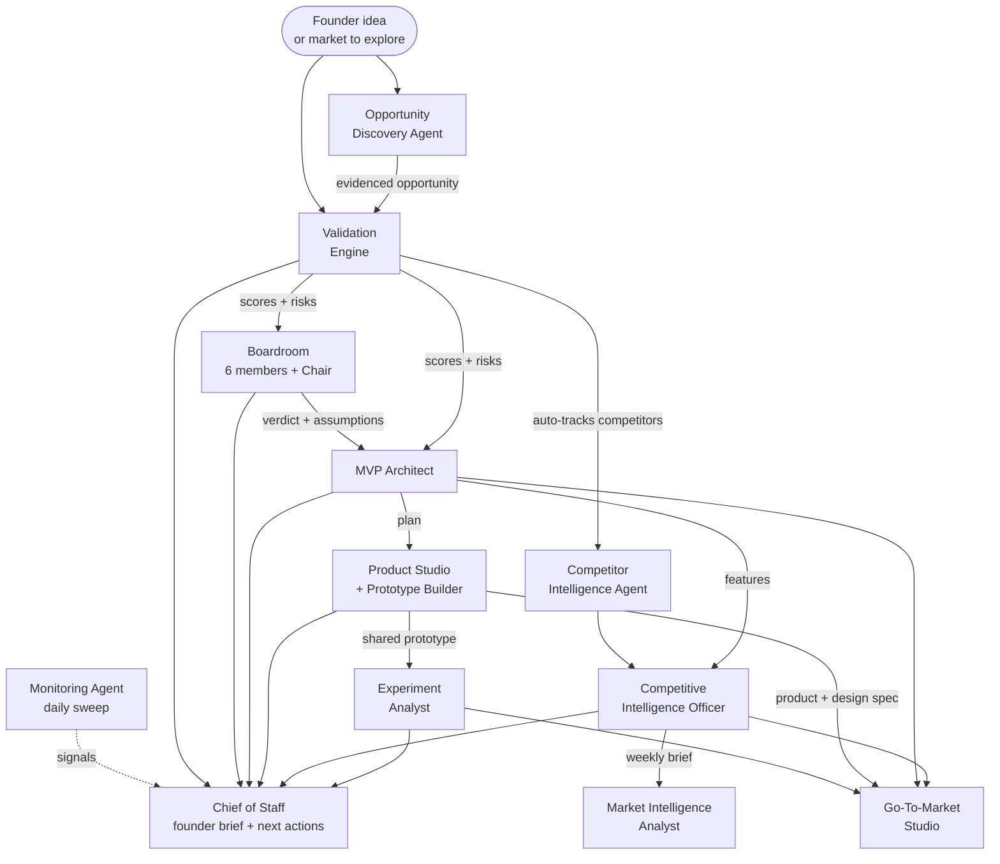

</details>

### 2. What each agent reads and writes

Agents never call each other. The Node API loads saved outputs and passes them in. Anything an agent learns is also written to **Venture Memory**.


<details><summary>Diagram source (Mermaid)</summary>

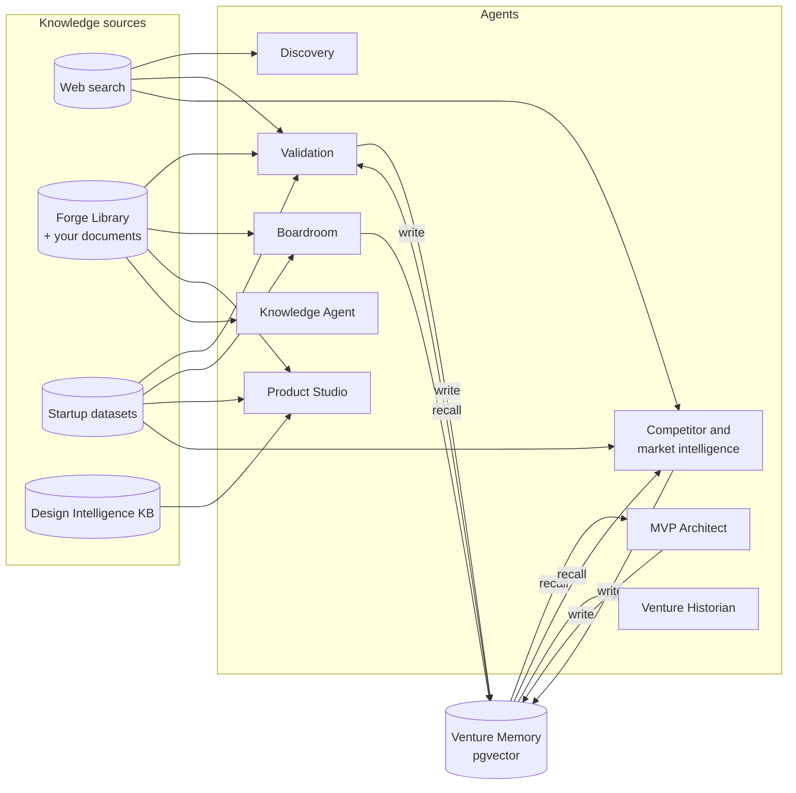

</details>

### 3. Which agent powers which feature

| Feature (page / tab) | Agent(s) | Reads | Produces |
| --- | --- | --- | --- |
| Discover opportunities | Opportunity Discovery Agent (3-stage pipeline, section 4) | Web search across communities, review sites, vendor forums, job boards, GitHub | Ranked, evidenced problems, each with a suggested startup |
| Validation | Validation Engine | Web search, Library, startup datasets, Venture Memory | 5 cited scores, risks, auto-tracked competitors |
| Boardroom | CEO, Investor, Product, Growth, Technical, Failure agents + Chair (LangGraph, section 5) | Validation, Library, startup datasets | GO / PIVOT / KILL verdict, assumptions, next steps |
| MVP Architect | MVP Architect (product call + engineering call + strategy call, section 6) | Validation, tracked competitors, boardroom verdict, Memory | Strategy, build-vs-buy, roadmap, risks, plus features, stories, schema, APIs |
| Prototype | Product Studio (LangGraph, section 7) and Prototype Builder (edits, syntax auto-repair) | MVP plan, validation, Library, datasets, Design Intelligence KB | Working, reviewed, scored prototype |
| Competitors | Competitor Intelligence Agent, Competitive Intelligence Officer | Competitor sites and news, MVP features, snapshot history | Profiles, weekly brief, feature gaps, white space, positioning map |
| Market signals | Market Intelligence Analyst, Monitoring Agent | News, community chatter, intel brief, Memory | Signals, opportunities, threats, outlook; daily notifications |
| Experiments | Experiment Analyst | Visitor and signup events, feedback | validated / invalidated / inconclusive plus next steps |
| Go-To-Market | GTM Studio (LangGraph, section 8) | Validation, MVP, prototype spec, intel, boardroom, traction | Brand, messaging, assets, ads, deck, launch-readiness score |
| Overview brief | Chief of Staff | Output of every module above | Founder brief and next recommended actions |
| Memory | Venture Historian | Everything stored in Venture Memory | Learnings, validated and failed assumptions, decision journal |
| Knowledge | Knowledge Agent | Forge Library and your documents | Cited answers |
| Design Intelligence | Design Intelligence pipeline (section 9) | A SaaS URL | Stored design analysis, searchable by Product Studio |

### 4. Opportunity Discovery pipeline

Problem-first: no startup idea is proposed until the problem is evidenced. Counts, evidence strength, ranking and the overall score are computed in code, never asserted by the model.


<details><summary>Diagram source (Mermaid)</summary>

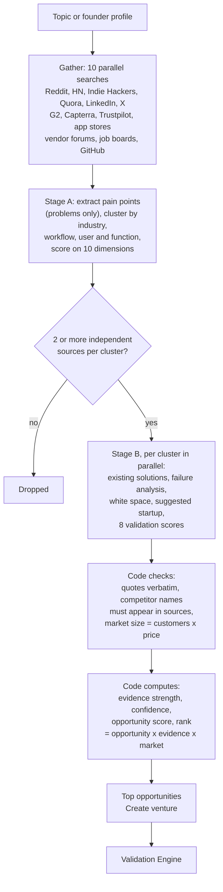

</details>

### 5. Boardroom (LangGraph)


<details><summary>Diagram source (Mermaid)</summary>

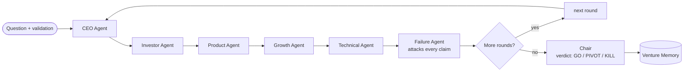

</details>

Each turn is saved as it happens, so the UI streams the debate and a reload picks it up.

### 6. MVP Architect


<details><summary>Diagram source (Mermaid)</summary>

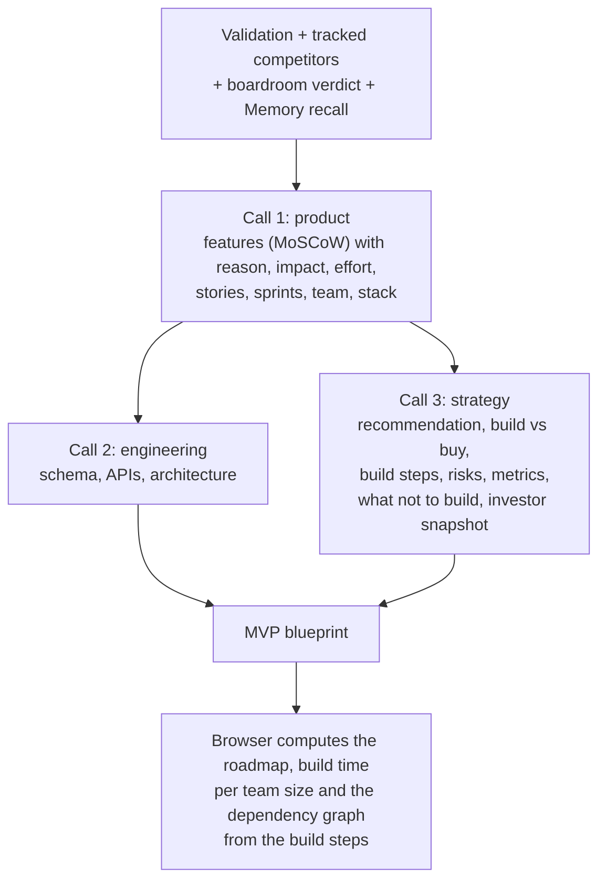

</details>

Calls 2 and 3 run in parallel. Build time, roadmap and graph layout are computed from the model's per-step effort and dependencies, so they always agree.

### 7. Product Studio (LangGraph)


<details><summary>Diagram source (Mermaid)</summary>

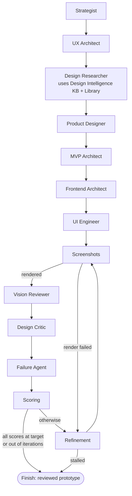

</details>

### 8. Go-To-Market Studio (LangGraph)


<details><summary>Diagram source (Mermaid)</summary>

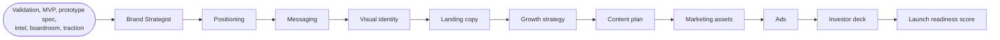

</details>

Each agent saves its result as it finishes, so the UI follows along and a failed run resumes.

### 9. Design Intelligence


<details><summary>Diagram source (Mermaid)</summary>

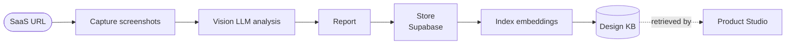

</details>

### Model routing

Groq's free tier allows about 8K tokens a minute per model, so calls fail over across models on rate limits or unparseable output. Large-context agents (Discovery) try Gemini first. All defaults can be overridden in `.env` (`LLM_MODEL`, `LLM_FAST_MODELS`, `GEMINI_MODELS`, `CODE_MODELS`, `VISION_MODELS`). Without an LLM key every agent falls back to clearly labelled demo templates.

## Dashboard pages

The sidebar is organised as **Venture Studio** (Ventures, Research, Boardroom, MVP Architect, Prototype, Go-To-Market, Validation Lab), **Intelligence** and **Operations** (Agent Activity, Settings).

- **Competitive Intelligence** (`/app/competitive-intelligence`, formerly Competitors) — brief, actions, watchlist, feature gaps, positioning map.
- **Market Signals** (`/app/market-signals`) — AI market radar: overview, signal feed, emerging opportunities, threat radar, trends, industry outlook. Signals must cite a source the agent actually fetched.
- **Venture Memory** (`/app/memory`) — the knowledge layer over `venture_memory` (every agent writes to it, embedded in pgvector): what we know, learning timeline, decision journal, validated/failed assumptions, semantic search and top learnings. "Synthesize" rebuilds the derived tables from the raw memories.

Run `supabase/migrations/009_market_signals_and_venture_memory.sql` to add the tables for the last two.

## Billing-ready

`backend/src/core.js` defines `PLANS` (Free / Pro / Studio) and enforces venture and monthly agent-run quotas server-side (HTTP 402). `users.plan` and `users.stripe_customer_id` exist; wiring Stripe means a checkout session plus a webhook that updates `users.plan`.

## API (all under `/api`, authenticated)

| Method | Path | Purpose |
| --- | --- | --- |
| GET/POST | `/ventures` | List / create |
| GET/PATCH/DELETE | `/ventures/:id` | Read / update stage / delete (cascades memory) |
| POST | `/discover` | Opportunity discovery |
| POST | `/ventures/:id/validate` | Validation engine |
| POST | `/ventures/:id/boardroom` | Boardroom debate (Server-Sent Events) |
| POST | `/ventures/:id/mvp` · `/ventures/:id/prototype` | MVP plan · build prototype |
| POST | `/research/:id/prototype/edit` · `/research/:id/prototype/undo` | Refine or revert a prototype |
| GET/POST | `/ventures/:id/memory` · `POST …/memory/search` | Venture memory |
| GET | `/research` · `/research/:id` | Reports |
| GET | `/boardroom` · `/boardroom/:id` | Sessions |
| GET/POST/PATCH/DELETE | `/competitors` · `POST /competitors/:id/scan` | Competitor tracking |
| GET | `/signals` · `POST /monitor/run` | Signals · manual monitoring sweep |
| GET/POST/PATCH/DELETE | `/experiments` · `POST /experiments/:id/events` · `/analyze` | Experiment center |
| GET/POST/DELETE | `/knowledge` · `POST /knowledge/search` · `/knowledge/ask` | Knowledge base (RAG) |
| GET | `/activity` · `/agent-runs` · `/notifications` · `/dashboard` · `/me` · `/config` | Workspace |

Public: `GET /p/:slug` (hosted prototype, sandboxed), `POST /p/:slug/signup`.

## Project structure

```
frontend/   React app — pages/, components/ (ui/ = shadcn primitives), lib/
backend/    Express API — src/index.js, core.js, db.js, routes/
ai/         FastAPI agents — main.py, core.py, agents.py, boardroom.py, demo.py
shared/     knowledge-seed.json (the Forge library)
supabase/   migrations/001_init.sql
```

## Design

The UI follows Sarvam AI's visual language: an off-white canvas, a saffron → periwinkle aurora behind heroes, hairline-framed eyebrows, pill buttons with a lit top edge, 16px hairline cards, dot-grid panels and gradient feature tiles. Fonts are free substitutes for Sarvam's licensed faces: Instrument Sans (display) and Geist (text).

## Startup datasets (`shared/*.csv`)

Agents and the Competitive Intelligence page use real data, never guesses. `ai/startupdata.py` cleans the CSVs, finds the companies that overlap with an idea (keyword + embedding search, then a model judges direct / adjacent / unrelated from the company's own text) and **computes** statistics in code (outcomes, funding, unicorns, deals), each with its sample size, period and caveat. Agents may only quote those peers (`P#`) and facts (`F#`); any number in a validation summary that is not in the sources the model was shown is removed.

| Used | For |
| --- | --- |
| `YC-all-batches.csv` (998, mostly 2025-26) | who is building this now |
| `Startupsss.csv` (688 early YC, 2005-14) | dead / exited / operating outcomes (as of ~2015) |
| `startup data.csv` (923 Crunchbase US, to 2013) | acquired vs closed rates (only those two outcomes are in the file) |
| `startup_funding.csv` (India deals 2015-20) | deal counts, amounts, investors (coverage collapses after 2017) |
| `unicorns till sep 2022.csv`, `Indian Unicorn startups 2023 updated.csv` | unicorn counts and valuations |
| `Startups1.csv`, `top_100_saas_companies_2025.csv` | names and descriptions only (their money fields are unreliable) |

Not used: `global_tech_startups_2026.csv` (synthetic), `Founders.csv`, `Startups.csv`. The CSVs are git-ignored and optional: without them (a fresh deployment) agents still run, just without the named peers and computed statistics. Copy them to `shared/` on the deployed AI service to enable them.
